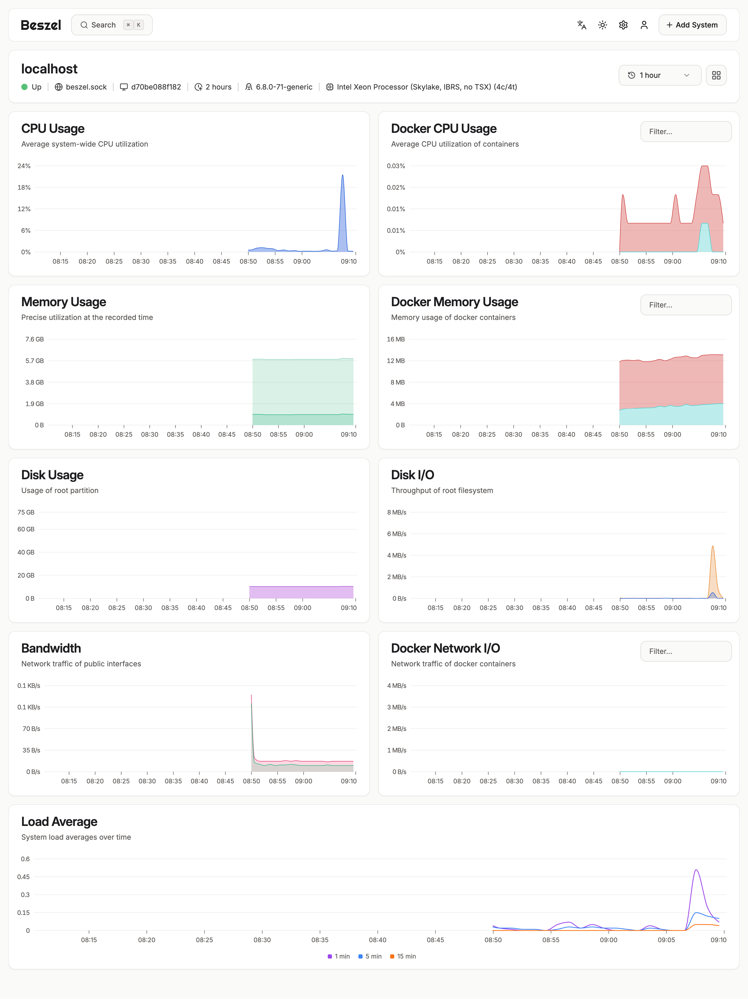

# About
## Beszel Docker Stack
This repository contains a docker-compose.yml file to quickly deploy the 
Beszel monitoring server and its agent. This setup is ideal for self-hosting 
Beszel to monitor a single machine via Docker.

## 🚀 Quick Start

**Generate authentication keys:**
Beszel requires a KEY and a TOKEN for the agent to authenticate with the server. 
You can generate these from: https://beszel.dev/guide/getting-started


**Clone the repository:**

```bash
git clone https://github.com/john-mwangi/server-monitoring.git
cd server-monitoring
```

**Create the .env file:**

```bash
echo "BESZEL_KEY=your_generated_key_here" > .env
echo "BESZEL_TOKEN=your_generated_token_here" >> .env
```

**Launch the containers:**
Start the Beszel server and agent in detached mode.

```bash
docker-compose up -d
```

**Access Beszel:**

The Beszel web interface will be available at http://localhost:8089.

## 🛑 Troubleshooting

* `WebSocket connection failed err="connect: connection refused"`: This means the agent can't reach the server.

Fix: Ensure both containers are running (docker-compose ps). The HUB_URL should point to the internal container port, http://beszel:8090.

* `WebSocket connection failed err="unexpected status code: 401"`: This is an authentication error.

Fix: Verify that the KEY and TOKEN in your .env file are correct and match the values expected by the beszel server.

* If issues persist, check the logs for both containers:

```bash
docker-compose logs beszel
docker-compose logs beszel-agent
```

## 📸 Screenshot

